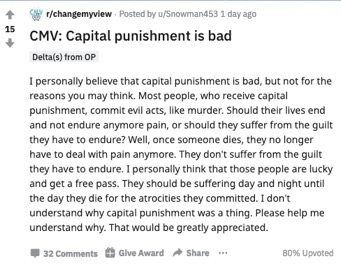
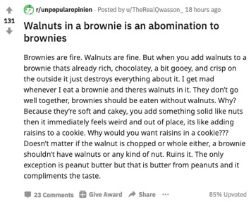
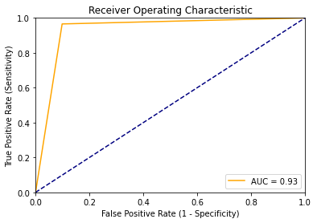
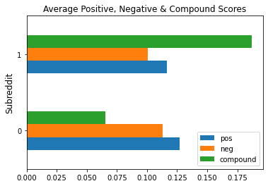

# A Classification Model for Identifying and Promoting Open-Minded Discussion on Reddit

 ## Contents:

- [Problem Statement](#Problem-Statement)  
- [Background](#Background)
- [Research](#Research)
- [Data](#Data)
- [Summary of Model](#Summary-Of-Analyses)
- [Conclusions and Recommendations](#Conclusions-and-Recommendations)

## Problem Statement

This project aims to distinguish subreddits that foster open-minded discussion from those that do not, and in doing so, to identify the features of subreddit posts that distinguish between the two classes. The goal is to produce a model that can be used by reddit and other social media websites to label and promote forums in which users engage with perspectives and opinions different from their own in a positive manner.

## Background

There has been [significant discussion](https://www.wsj.com/articles/why-social-media-is-so-good-at-polarizing-us-11603105204) in the last decade over the extent to which social media has contributed to an increasingly polarized social climate in the United States. Reddit in particular has [moved towards moderating speech](https://variety.com/2020/digital/news/reddit-bans-hate-speech-groups-removes-2000-subreddits-donald-trump-1234692898/) on their platform more stringently, now banning and removing hate speech, for instance. I wondered if it would be possible to take the opposite approach and improve the overall climate of social media platforms such as reddit by identifying and labeling content that promotes open-minded discussion.

## Research

Reddit is a social media website that bills itself as ”the front page of the internet”. It is essentially a virtual bulletin board consisting entirely of user-generated content. Content is organized topically by subreddits, which are also called communities. Subreddits are overseen by moderators, who are typically users who create and set rules for the content of a particular subreddit. Individual posts on subreddits can be upvoted or downvoted, resulting in an overall score. The posts with the highest scores are shown on reddit’s [homepage](https://www.reddit.com/).

I identified two subreddits to train and test classification my model: [r/unpopularopinion](https://www.reddit.com/r/unpopularopinion/), and [r/changemyview](https://www.reddit.com/r/changemyview/). Both communities were created for members to express and elaborate on opinions that they hold. However, the r/changemyview About Community section states that it is a place to post an opinion that you accept may be flawed, in an effort to understand other perspectives on the issue". In contrast, r/unpopularopinion requires members to post and elaborate only on opinions that they believe to be unpopular or controversial. Examples of posts from each subreddit are shown below:

| r/changemyview                                                                         |  r/unpopularopinion                                                                         |
|-------------------------------------------------------------------------------------------|-----------------------------------------------------------------------------------------------|
|  |  |

## Data

* [subreddit_scrape.csv](data/subreddit_scrape.csv): Subreddit 'top' posts scraped from r/changemyview (936 posts) and r/unpopularopinion (954 posts) subreddits spanning from 05/2013 to 10/18/2020
* [subreddit_scrape_2.csv](data/subreddit_scrape_2.csv): Additional subreddit 'new' posts scraped from r/changemyview (500) and r/unpopularopinion (500) subreddits, spanning from 10/01/2020 to 10/22/2020
* [modeling_df.csv](data/modeling_df.csv): Clean version of the original subreddit_scrape data used for modeling
* [additional_data.csv](data/additional_data.csv): Clean version of the subreddit_scrape_2 data incorporated for modeling

### Data Dictionary

A link to the Data Dictionary is available [here](data_dictionary.md).

## Executive Summary

### The Model
My final production model utilizes a Random Forest Classifier to predict the subreddit from which a post originated. I utilized `GridSearchCV` to optimize the `RandomForest` parameters of `n_estimators` (`200`), `max_depth` (`None`), and `max_features` (`None`).

Here is a table depicting the summary statistics for the model. Summary statistics and the model's ROC-AUC curve are depicted below.  

|                    | precision | recall | f1-score | support |
| ------------------ | --------- | ------ | -------- | ------- |
| r/unpopularopinion | 0.97      | 0.90   | 0.94     | 436     |
| r/changemyview     | 0.88      | 0.97   | 0.92     | 320     |
| Accuracy           |           |        | 0.93     | 756     |
| Macro Average      | 0.93      | 0.93   | 0.93     | 756     |
| Weighted Averge    | 0.93      | 0.93   | 0.93     | 756     |

Shown here is a graph of the Receiver Operating Characteristics (ROC). ROC-AUC Score was 0.968.

### Model Insights and Generalizability

### Quantified Text Features
Body word count, body character length, title character length, and title upper case ratio features were engineered from text data and shown to significantly correlate to the "open-minded" subreddit class (r/changemyview). I hypothesize that posts in which the user is open to changing their opinion tend to be more elaborative than those posts by which a user is stating an opinion/perspective which they are not open to changing.

### A Note Regarding Comments and Reddit Score
Though the number of comments and reddit post score significantly correlated with the r/unpopularopinion class, and would likely improve model accuracy, I chose not to include these features because they likely reflect the greater popularity and visibility of r/unpopularopinion (ranked 14th in top subreddits) over r/changemyview (ranked 44th in top subreddits). This decision was necessary in order to maintain generalizability of the model to other subreddits.  

### Valence
Using the [Valence Aware Dictionary and sEntiment Reasoner (VADER)](https://www.nltk.org/howto/sentiment.html) library, the model quantifies differences in valence between the r/unpopularopinion and r/changemyview subreddits. As hypothesized, the valence of the r/changemyview subreddit is more positive than the r/unpopularopinion subreddit, as evidenced by the difference in compound scores between the two:

The negative, positive, neutral and compound valence features not only improve the model's accuracy, but increase its generalizability to other subreddits.

### Stopwords
A custom stopwords list was appended to `scikit-learn`'s english stopwords for `TfidfVectorization` prior to modeling. The custom stopwords list included the following words/characters:

- cmv
- change
- view
- unpopular
- opinion

These words were excluded from modeling in order to ensure that the model did not distinguish between subreddits by subreddit tags in posts, ensuring generalizability.

## Conclusions and Recommendations
With a final Accuracy of 93%, and a Recall of 97% for the r/changemyview subreddit, it is reasonable to utilize this model to identify and potentially amplify subreddits that promote open-minded discussion. Reddit could use this research to create a subsection of their homepage that promotes subreddits identified and labeled as "open-minded", or could augment the scores of such posts to increase their visibility on Reddit. In this way, Reddit would take a proactive role in combating the role that social media is playing in social hyperpolarization.
